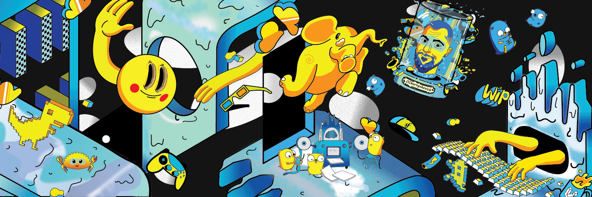

  

<h1 align="center">Oleg Charnyshevich</h1>

  
  
  

 

<table>
  <thead>
    <tr>
      <th>Project</th>
      <th>Description</th>
      <th>Repos</th>
      <th>Stack</th>
    </tr>
  </thead>
  <tbody>
    <tr>
      <td><a href="https://github.com/go-theft-auto"><b>go-theft-auto</b></a></td>
      <td>GTA tooling in Go</td>
      <td>
        <a href="https://github.com/go-theft-auto/renderware">renderware</a> &middot;
        <a href="https://github.com/go-theft-auto/gui">gui</a>
      </td>
      <td> </td>
    </tr>
    <tr>
      <td><a href="https://github.com/go-theft-craft"><b>go-theft-craft</b></a></td>
      <td>Minecraft tooling in Go</td>
      <td>
        <a href="https://github.com/go-theft-craft/server">server</a>
      </td>
      <td></td>
    </tr>
    <tr>
      <td><a href="https://github.com/love4dev"><b>love4dev</b></a></td>
      <td>Personal blog &middot; <a href="https://love4dev.com">love4dev.com</a></td>
      <td>&mdash;</td>
      <td> </td>
    </tr>
    <tr>
      <td><b>srb.guide</b></td>
      <td>Serbian guide &middot; <a href="https://srb.guide">srb.guide</a></td>
      <td>&mdash;</td>
      <td> </td>
    </tr>
    <tr>
      <td><b>stats.srb.guide</b></td>
      <td>Statistics for srb.guide &middot; <a href="https://stats.srb.guide">stats.srb.guide</a></td>
      <td>&mdash;</td>
      <td>   </td>
    </tr>
    <tr>
      <td><b>izjava.rs</b></td>
      <td>Business info website &middot; <a href="https://izjava.rs">izjava.rs</a></td>
      <td>&mdash;</td>
      <td>  </td>
    </tr>
  </tbody>
</table>
